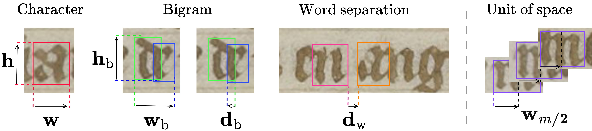

# <p align="center"> Leveraging Morphology for Historical Script Metrological Analysis (ICDAR 2026) <p/>
# <p align="center"> 🔗 [Project Webpage](https://malamatenia.github.io/morphology4metrology-analysis/) </p> <p align="center"> <sub> [Malamatenia Vlachou Efstathiou*](https://malamatenia.github.io/), [Raphael Baena*](https://raphael-baena.github.io/), [Dominique Stutzmann](https://www.irht.cnrs.fr/fr/annuaire/stutzmann-dominique), [Mathieu Aubry](https://mathieuaubry.github.io/)</sub> </p>

## Purpose
 <br>
 
This repository contains the scripts, notebook, and data needed to **reproduce the metrological analysis** of the paper. It also documents how to **adapt the analysis to other datasets**.

<br>

> **Note:** This repository performs the downstream metrological and paleographical analysis (and reproduces the visualizations reported in the paper). To do so, it uses the outputs from the **[morphology4metrology](https://github.com/raphael-baena/morphology4metrology/tree/main)** architecture, which handles training and output generation.

## Content
<details>
<summary>Reproduce the paper </summary>
<br>
 
> **Note:** First, you have to download the paper `dataset`, available on Zenodo with [](https://doi.org/10.5281/zenodo.18745702).
<br>
Open `metrological_analysis.ipynb`. The notebook:
 
1. Builds the working corpus in `input/`, as described in §3.2 of the paper.
2. Computes every metric defined in the paper: letter aspect ratios, bigram edge-to-edge distances, word distances.
3. Renders the linear and crossed plots (Figures 6 and 7 in the paper) into `results/`
</details>
 
<details>
<summary>Run it on your data </summary>
 
 <br>
Two steps:

 <br>
 
**1. Generate outputs for your manuscript.** Train on the [morphology4metrology](https://github.com/raphael-baena/morphology4metrology/tree/main) method. After finetuning on a set of documents, you will obtain:
 
- A folder of per-line prediction JSONs (one folder per document, one `.json` per line).
- A `transcribe.json` mapping character indices to characters.
- A folder of per-document character prototypes.
<br>

**2. Adapt the metrological analysis to your metadata**. More details in `metrological_analysis.ipynb`.

</details>

## Cite us
```bibtex
@misc{vlachou2026metrology,
    title = {Leveraging Morphology for Historical Script Metrological Analysis},
    author = {Vlachou-Efstathiou, Malamatenia and Baena, Raphael and Stutzmann, Dominique and Aubry, Mathieu},
    publisher = {Document Analysis and Recognition--ICDAR 2026 Vienna, Austria, August 30--September 4, 2026, Proceedings},
    year = {2026},
    organization={Springer}
```
Check out also: 
- [Baena, R., Kalleli, S., & Aubry, M. (2024). General Detection-based Text Line Recognition.](https://detection-based-text-line-recognition.github.io/)
- [Vlachou Efstathiou, M, Siglidis, I., Stutzmann, D., & Aubry, M. (2024). An Interpretable Deep Learning Approach for Morphological Script Type Analysis.](https://learnable-handwriter.github.io/)
- [Siglidis, I., Gonthier, N., Gaubil, J., Monnier, T., & Aubry, M. (2023). The Learnable Typewriter: A Generative Approach to Text Analysis.](https://imagine.enpc.fr/~siglidii/learnable-typewriter/)
## Acknowledgements
This study was supported by the CNRS through MITI and the 80|Prime program (CrEMe Caractérisation des écritures médiévales), and by the European Research Council (ERC project DISCOVER, number 101076028). We thank Sonat Baltacı, Syrine Kalleli, Marta Lopez-Rahut for valuable feedback on the paper. This work was granted access to the HPC resources of IDRIS under the allocation AD010614956R1 and AD011015222 made by GENCI.
